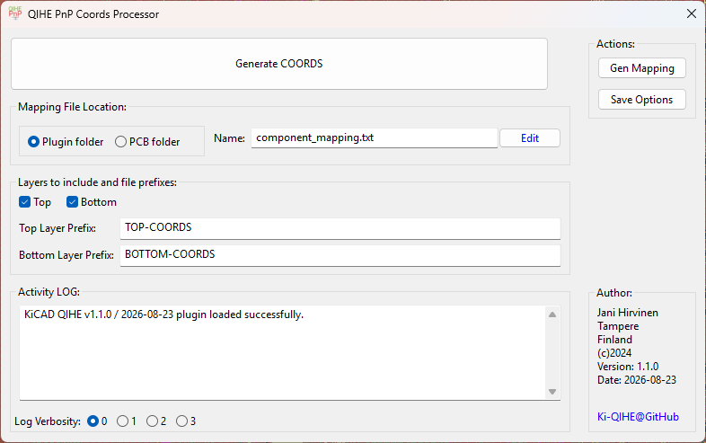

# Ki-QIHE — QIHE PnP Coords Processor for KiCad



A KiCad PCB-editor plugin that generates coordinate files for QIHE tabletop
pick-and-place machines directly from your board. Map component values to
nozzles and feeders — including size-specific feeders — and get machine-ready
CSV files for the top and bottom layers.

## Features

- Generate coordinates for the top, bottom, or both layers, with custom file prefixes.
- Component mapping: value → nozzle + feeder, with **size-specific feeders** (`L1:0402`, `B12:0603`).
- Imperial **and** metric size detection (0402/0603/0805/… and 1005/1608/2012/…).
- Priority (`P`) and exclude (`E`) rules with regex patterns.
- Optional `FIDORIG` fiducial as the coordinate origin (falls back to the page origin).
- Respects KiCad footprint attributes (excluded from position files / BOM).
- Mapping file editable from the dialog; settings remembered between sessions.
- Activity log with verbosity levels 0–3.

## Compatibility

- KiCad 8.0 – 10.x (installed and verified on KiCad 10).
- Classic SWIG `pcbnew` action plugin; Windows, Linux, and macOS.

## Supported machines

- QIHE TVM-802A running the Qihe placement software
- QIHE TVM-802B running the Qihe placement software

## Installation

Via the KiCad Plugin and Content Manager (PCM):

1. KiCad main window → Tools → Plugin and Content Manager.
2. Search for **KI-Qihe** (official repository), or use **Install from File…**
   with a release zip from [GitHub Releases](https://github.com/jpkh/ki_qihe/releases).
3. Apply changes and restart the PCB editor.

## Usage

Open a board in the PCB editor and click the QIHE toolbar button, select the
layers and options, then press **Generate COORDS**.

Files are written next to the board as `<board>_TOP-COORDS.csv` and
`<board>_BOTTOM-COORDS.csv` (the `TOP-COORDS`/`BOTTOM-COORDS` parts are
configurable prefixes).

### Dialog overview

- **Generate COORDS** — runs generation for the checked layers.
- **Top / Bottom checkboxes and prefixes** — which layers to process and what to call the files.
- **Activity LOG** — live progress; verbosity 0 (minimal) to 3 (debug).
- **Mapping File Location** — plugin folder or PCB project folder; the file
  name is configurable and **Edit** opens it in your default editor.
- **Gen Mapping** — (re)creates the default mapping file.
  ⚠️ Overwrites the current file — use with caution.
- **Save Options** — persists the current dialog settings.

## Component mapping file

Default name `component_mapping.txt`, created automatically on first use.
Reference copy with examples: [`assets/component_mapping.txt`](assets/component_mapping.txt).

| Line type | Syntax | Meaning |
|---|---|---|
| Mapping | `nozzle, feeder[:SIZE], value[:alias]…` | `nozzle` is `1` or `2`; `feeder` is `Lxx` or `Bxx`; optional `:SIZE` tag; colon-separated value aliases |
| Exclude | `E, , regex[:regex]…` | components whose value matches a regex are left out |
| Priority | `P, , regex[:regex]…` | matching components are listed first in the output |

Examples:

```
1, L20:0402, 0u1:0.1u:100nF:0.1uF:0.1uf
1, L12:0402, 1k:1K
2, B3:0603, 120R:120r
E, , NC:TP
P, , FIDUCIAL:TESTPOINT
```

Notes:

- Size tags accept imperial codes (`0402`, `0603`, `0805`, …) and metric codes
  (`1608` → `0603`, `2012` → `0805`, …).
- A feeder without `:SIZE` matches any size; a size-specific entry wins when
  the footprint's size is detected.
- Value aliases are matched as written — add every spelling you use, separated
  by `:`. Exclude/priority patterns are case-insensitive regex.
- A footprint whose reference starts with `FIDORIG` is used as the coordinate
  origin; otherwise the page origin is used and a warning is logged.

### Output columns

`Designator, NozzleNum, StackNum, Mid X, Mid Y, Rotation, Height, Speed,
Vision, Check, Explanation`

## Contributing

Contributions are welcome! Please open pull requests, or file issues for bugs,
feature requests, and suggestions through the
[GitHub Issues](https://github.com/jpkh/ki_qihe/issues) page.

## Support

If you encounter problems or have questions, please file an issue.

## License

GPL-3.0 — see [LICENSE](LICENSE).

## Acknowledgments

Thanks to all contributors who have helped test, refine, and extend this plugin.
